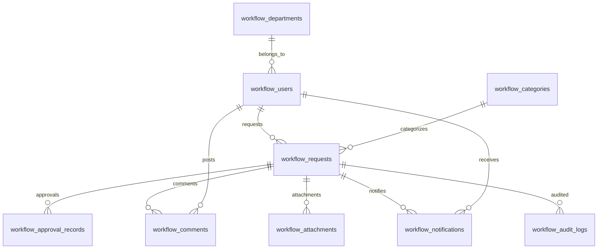

# FlowDesk データベース構成

## 全体像

`workflow_users.id` は `auth.users.id` と同一です。認証情報はSupabase Auth、業務上の氏名・役割・部署・有効状態は `workflow_users` で管理します。

## テーブル

| テーブル | 役割 | 主な制約・保護 |
|---|---|---|
| `workflow_departments` | 部署と部署承認者 | 部署名一意、承認者はユーザーFK |
| `workflow_users` | 役割・部署・有効状態 | Authユーザーと1対1、4種類のenumロール |
| `workflow_categories` | 依頼カテゴリ | 名称一意、論理無効化 |
| `workflow_requests` | 案件本体 | 状態・優先度enum、申請者/承認者/担当者FK、`version` による楽観ロック |
| `workflow_approval_records` | 承認判断の記録 | 承認・却下・差し戻し、理由、実行者、日時 |
| `workflow_comments` | 案件コメント | 投稿者、本文、投稿日時 |
| `workflow_attachments` | 添付メタデータ | Storage上のパス、MIME、サイズ、投稿者 |
| `workflow_notifications` | システム内通知 | 受信者、案件、本文、既読状態・既読日時 |
| `workflow_audit_logs` | 監査ログ | 実行者、操作、要約、変更メタデータ、日時 |

## 状態遷移

| 現在 | 操作 | 次 | 実行可能者 |
|---|---|---|---|
| 下書き / 差し戻し | 申請 | 承認待ち | 申請者本人 |
| 承認待ち | 承認 | 承認済み | 対象部署の承認者 |
| 承認待ち | 却下 | 却下 | 対象部署の承認者（理由必須） |
| 承認待ち | 差し戻し | 差し戻し | 対象部署の承認者（理由必須） |
| 承認済み | 担当者設定・変更 | 承認済み | 管理者 |
| 承認済み | 作業開始 | 対応中 | 割り当て済み担当者本人 |
| 対応中 | 完了 | 完了 | 割り当て済み担当者本人 |

## サーバー側権限制御

1. RLSが「どの行を閲覧できるか」を決定します。
2. `authenticated` には業務テーブルの直接 `INSERT / UPDATE / DELETE` を与えません。
3. 書き込みは `SECURITY DEFINER` RPCで行い、呼出者、有効状態、役割、現在状態、対象者、入力値を検証します。
4. RPCは `search_path` を固定し、権限昇格時のオブジェクト差し替えを防ぎます。
5. 管理者のAuth操作だけはEdge Functionがサーバー専用Secret Key（旧環境ではService Role Key）を使用し、JWTと管理者ロールを二重確認します。
6. Storageは非公開バケットとオブジェクトポリシーで保護します。

## マイグレーション

- `20260924150000_final_workflow_schema.sql`: 型、テーブル、索引、トリガー、RLS、Storage、初期カテゴリ
- `20260924151000_final_workflow_rpc.sql`: 状態遷移・コメント・添付・通知・ダッシュボードRPCと権限付与
