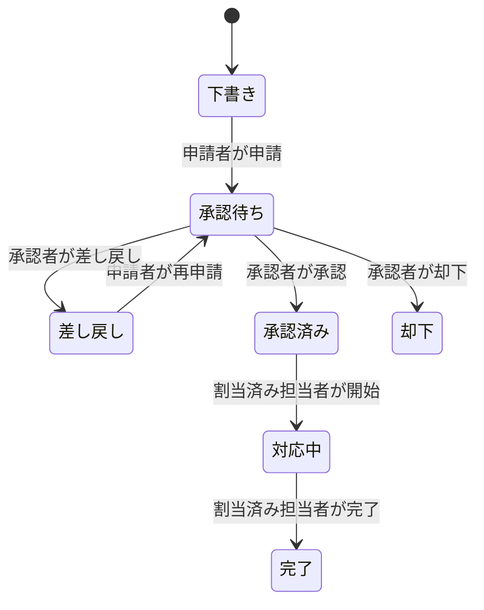

# 社内業務依頼・承認ワークフロー管理システム 仕様書

- 課題区分：AI駆動開発トレーニング 最終課題
- 文書版：v0.1
- 作成日：2026-09-24
- 実装方針：最低クリア要件を確実に満たし、権限・状態遷移・監査性を優先する

## 1. 目的

社員が業務依頼を登録し、承認者の判断、管理者による作業担当者の割り当て、担当者の作業完了までを一つのシステム上で管理する。

評価上の中心は次の3点とする。

1. ユーザーごとに閲覧可能な情報が異なること
2. 役割と現在の状態に応じて実行可能な操作が異なること
3. 重要な処理をフロントエンドだけに任せず、DB・RPC・RLS・Edge Functionでも検証すること

## 2. スコープ

### 2.1 必須範囲

- メールアドレスとパスワードによるログイン・ログアウト
- 4種類のユーザー権限
- ユーザー・部署・カテゴリ管理
- 案件の作成、編集、削除、申請
- 承認、却下、差し戻し
- 管理者による担当者設定・変更
- 担当者による作業開始・完了
- コメント
- 画像・PDFの添付
- システム内通知と未読・既読管理
- 一覧検索・絞り込み
- 役割別ダッシュボード
- 案件単位およびシステム全体の操作履歴
- RLSとサーバー側処理による権限制御
- 必須シナリオおよび主要異常系のテスト

### 2.2 今回は実装しないもの

- 生成AI機能
- メール・外部チャットへの通知
- 複数段階承認
- 1案件への複数担当者割り当て
- コメントの編集・削除
- リッチテキスト入力
- ドラッグ＆ドロップによる状態変更
- 添付画像・PDFの高度なプレビュー
- 却下案件の再申請

## 3. 技術構成

| 領域 | 採用技術 | 選定理由 |
| --- | --- | --- |
| フロントエンド | Vanilla HTML / CSS / JavaScript | 既存課題と同じ構成を継続し、業務ロジックと権限制御の理解に集中するため |
| 静的ホスティング | GitHub Pages | 既存リポジトリの公開方式を継続できるため |
| 認証 | Supabase Auth | セッション管理とDBのユーザーIDを統一できるため |
| DB | Supabase PostgreSQL | RLS、RPC、トランザクション、監査ログを一つの基盤で実装できるため |
| 権限制御 | RLS + PostgreSQL RPC | URL・REST APIの直接操作でも権限を回避できないようにするため |
| ファイル | Supabase Storageの非公開バケット | AuthとRLSを利用して案件関係者だけに公開できるため |
| 管理者ユーザー操作 | Supabase Edge Function | サーバー専用Secret Keyをブラウザへ公開せず、管理者権限を再検証するため |
| リアルタイム更新 | Supabase Realtime（通知のみ、実装余力に応じて） | 必須処理はDB保存で成立させ、Realtime障害時も再読込で復元できるようにするため |

## 4. ユーザーと役割

ユーザーは原則として1つの役割を持つ。テストでは役割ごとに別アカウントを用意する。

| 内部値 | 表示名 | 主な責務 |
| --- | --- | --- |
| `requester` | 一般ユーザー | 案件を作成・申請し、自分の案件の進捗を確認する |
| `approver` | 承認者 | 自分が承認担当となっている案件を承認・却下・差し戻しする |
| `worker` | 作業担当者 | 自分に割り当てられた案件を開始・完了する |
| `admin` | 管理者 | 全件確認、ユーザー・マスタ管理、担当者設定、全体履歴確認を行う |

全役割について `profiles.is_active = true` を操作可能条件とする。無効化されたユーザーは、既存セッションが残っていても業務データを取得・更新できない。

## 5. 業務上の前提

1. 各部署には有効な承認者を1人設定する。
2. 一般ユーザーの所属部署は管理者が設定する。
3. 申請時に、申請者の所属部署に設定された承認者を案件の `approver_id` として固定する。
4. 部署または承認者が未設定の場合、申請は失敗させ、画面へ明確なエラーを表示する。
5. 承認後の作業担当者設定・変更は管理者だけが行う。
6. 担当者は作業担当者ロールかつ有効なユーザーに限る。
7. 却下は終了状態とし、再申請は行わない。
8. 差し戻し案件は申請者が編集し、同じ案件を再申請できる。

## 6. ステータスと状態遷移

| 内部値 | 表示名 | 次に可能な操作 |
| --- | --- | --- |
| `draft` | 下書き | 申請者が編集・削除・申請 |
| `pending_approval` | 承認待ち | 承認者が承認・却下・差し戻し |
| `approved` | 承認済み | 管理者が担当者を設定、担当者が作業開始 |
| `in_progress` | 対応中 | 担当者が作業完了、管理者が担当者変更 |
| `completed` | 完了 | 閲覧・コメント |
| `rejected` | 却下 | 閲覧・コメント |
| `returned` | 差し戻し | 申請者が編集・削除・再申請 |

### 6.1 正常な遷移



状態を自由選択するUIは用意しない。各操作ボタンが、許可された遷移専用のRPCを呼び出す。

## 7. 操作権限表

| 操作 | 一般ユーザー | 承認者 | 作業担当者 | 管理者 |
| --- | --- | --- | --- | --- |
| 案件作成 | 自分の案件のみ | 不可 | 不可 | 不可 |
| 案件閲覧 | 自分の案件のみ | 自分が承認担当の案件のみ | 自分の担当案件のみ | 全件 |
| 案件編集 | 自分の下書き・差し戻しのみ | 不可 | 不可 | 原則不可 |
| 案件削除 | 自分の下書き・差し戻しのみ | 不可 | 不可 | 不可 |
| 申請・再申請 | 自分の下書き・差し戻しのみ | 不可 | 不可 | 不可 |
| 承認・却下・差し戻し | 不可 | 自分の承認待ち案件のみ | 不可 | 不可 |
| 担当者設定・変更 | 不可 | 不可 | 不可 | 承認済み・対応中のみ |
| 作業開始 | 不可 | 不可 | 自分の承認済み案件のみ | 不可 |
| 作業完了 | 不可 | 不可 | 自分の対応中案件のみ | 不可 |
| コメント追加 | 自分の案件 | 承認担当案件 | 担当案件 | 全案件 |
| 案件履歴閲覧 | 自分の案件 | 承認担当案件 | 担当案件 | 全案件 |
| 全体履歴閲覧 | 不可 | 不可 | 不可 | 可 |
| ユーザー・マスタ管理 | 不可 | 不可 | 不可 | 可 |

管理者は業務担当者の代理操作を行わない。管理者に万能な状態変更権限を与えず、役割分離を明確にする。

## 8. データモデル

### 8.0 既存テーブルとの分離

既存のPart 4では `public.profiles` と `public.messages` を使用している。`public.profiles` はチャット用の公開プロフィールであり、認証済みユーザー本人による更新も許可されているため、最終課題の役割・部署・有効状態は保存しない。

最終課題の実テーブル、型、関数、ポリシーには `workflow_` 接頭辞を付ける。本節以降の論理名との対応は次のとおりとする。

- `profiles` → `workflow_users`
- `departments` → `workflow_departments`
- `categories` → `workflow_categories`
- `requests` → `workflow_requests`
- その他の関連テーブル・型・RPC → `workflow_` 接頭辞付き名称

これにより既存Part 4〜6のDB資産を変更せず、最終課題のRLSと権限モデルを独立させる。

### 8.1 Enum

- `user_role`: `requester`, `approver`, `worker`, `admin`
- `request_status`: `draft`, `pending_approval`, `approved`, `in_progress`, `completed`, `rejected`, `returned`
- `request_priority`: `low`, `normal`, `high`, `urgent`
- `approval_action`: `approved`, `rejected`, `returned`
- `audit_action`: `created`, `updated`, `deleted`, `submitted`, `resubmitted`, `approved`, `rejected`, `returned`, `assigned`, `reassigned`, `started`, `completed`, `commented`, `attachment_added`, `attachment_deleted`

### 8.2 `profiles`

| 列 | 型 | 制約・用途 |
| --- | --- | --- |
| `id` | uuid | PK、`auth.users.id`参照 |
| `display_name` | text | 必須、1〜80文字 |
| `role` | user_role | 必須 |
| `department_id` | uuid | `departments.id`参照。管理者以外は原則必須 |
| `is_active` | boolean | 既定値true |
| `created_at` | timestamptz | 必須 |
| `updated_at` | timestamptz | 必須 |

### 8.3 `departments`

| 列 | 型 | 制約・用途 |
| --- | --- | --- |
| `id` | uuid | PK |
| `name` | text | 必須、一意 |
| `approver_id` | uuid | 有効な承認者を参照 |
| `is_active` | boolean | 既定値true |
| `created_at` | timestamptz | 必須 |
| `updated_at` | timestamptz | 必須 |

### 8.4 `categories`

| 列 | 型 | 制約・用途 |
| --- | --- | --- |
| `id` | uuid | PK |
| `name` | text | 必須、一意 |
| `is_active` | boolean | 既定値true |
| `sort_order` | integer | 0以上 |
| `created_at` | timestamptz | 必須 |
| `updated_at` | timestamptz | 必須 |

初期値として「システム改修」「備品購入」「データ抽出」「資料作成」「アカウント発行」「その他」を登録する。

### 8.5 `requests`

| 列 | 型 | 制約・用途 |
| --- | --- | --- |
| `id` | uuid | PK |
| `request_number` | bigint identity | 画面表示用の連番 |
| `title` | text | 必須、1〜120文字 |
| `description` | text | 必須、1〜5000文字 |
| `category_id` | uuid | 有効なカテゴリ参照 |
| `priority` | request_priority | 必須 |
| `desired_due_date` | date | 必須 |
| `requester_id` | uuid | 申請者 |
| `department_id` | uuid | 作成時の所属部署を保持 |
| `approver_id` | uuid | 初回申請時に固定 |
| `assignee_id` | uuid | 未割当時null |
| `status` | request_status | 作成時 `draft` |
| `submitted_at` | timestamptz | 未申請時null |
| `approved_at` | timestamptz | 未承認時null |
| `started_at` | timestamptz | 未開始時null |
| `completed_at` | timestamptz | 未完了時null |
| `created_at` | timestamptz | 必須 |
| `updated_at` | timestamptz | 必須 |
| `version` | integer | 楽観ロック用、既定値1 |

### 8.6 `approval_records`

| 列 | 型 | 制約・用途 |
| --- | --- | --- |
| `id` | uuid | PK |
| `request_id` | uuid | 案件参照 |
| `approver_id` | uuid | 実行者 |
| `action` | approval_action | 承認・却下・差し戻し |
| `reason` | text | 却下・差し戻し時は必須、1〜1000文字 |
| `created_at` | timestamptz | 必須 |

### 8.7 `request_comments`

| 列 | 型 | 制約・用途 |
| --- | --- | --- |
| `id` | uuid | PK |
| `request_id` | uuid | 案件参照 |
| `author_id` | uuid | 投稿者 |
| `body` | text | 必須、1〜2000文字 |
| `created_at` | timestamptz | 必須 |

コメントは追記専用とし、編集・削除は実装しない。

### 8.8 `request_attachments`

| 列 | 型 | 制約・用途 |
| --- | --- | --- |
| `id` | uuid | PK |
| `request_id` | uuid | 案件参照 |
| `storage_path` | text | 非公開バケット内のパス、一意 |
| `original_name` | text | 元ファイル名 |
| `mime_type` | text | `image/jpeg`, `image/png`, `application/pdf`のみ |
| `size_bytes` | bigint | 1ファイル10MiB以下 |
| `uploaded_by` | uuid | 投稿者 |
| `created_at` | timestamptz | 必須 |

案件あたり最大5ファイルとする。申請者が `draft` または `returned` の間だけ追加・削除できる。

### 8.9 `notifications`

| 列 | 型 | 制約・用途 |
| --- | --- | --- |
| `id` | uuid | PK |
| `recipient_id` | uuid | 通知受信者 |
| `request_id` | uuid | 関連案件。システム通知ではnull可 |
| `type` | text | 通知種別 |
| `title` | text | 一覧表示文 |
| `body` | text | 補足文 |
| `is_read` | boolean | 既定値false |
| `created_at` | timestamptz | 必須 |
| `read_at` | timestamptz | 未読時null |

### 8.10 `audit_logs`

| 列 | 型 | 制約・用途 |
| --- | --- | --- |
| `id` | bigint identity | PK |
| `request_id` | uuid | 案件参照。管理操作ではnull可 |
| `actor_id` | uuid | 実行者 |
| `action` | audit_actionまたはtext | 操作種別 |
| `from_status` | request_status | 状態変更前。該当しない場合null |
| `to_status` | request_status | 状態変更後。該当しない場合null |
| `summary` | text | 人が読める操作内容 |
| `metadata` | jsonb | 担当者変更前後など必要最小限 |
| `created_at` | timestamptz | 必須 |

監査ログは追記専用とし、クライアントからの更新・削除を許可しない。機密情報、コメント全文、添付内容、パスワードは記録しない。

## 9. サーバー側業務処理

案件テーブルへの直接 `insert`、`update`、`delete` は認証済みユーザーにも原則許可しない。次の専用RPCを使用する。

| RPC | 実行者 | 主な検証 | 主な結果 |
| --- | --- | --- | --- |
| `create_request` | 一般ユーザー | 有効ユーザー、入力値、所属部署 | 下書き作成、履歴追加 |
| `update_request` | 申請者 | 所有者、`draft/returned`、version一致 | 内容更新、version加算、履歴追加 |
| `delete_request` | 申請者 | 所有者、`draft/returned` | 添付削除対象確認、案件削除、履歴追加 |
| `submit_request` | 申請者 | 所有者、`draft/returned`、部署承認者 | `pending_approval`、承認者固定、通知・履歴 |
| `approve_request` | 承認者 | `approver_id = auth.uid()`、承認待ち | `approved`、承認記録、通知・履歴 |
| `reject_request` | 承認者 | 担当承認者、承認待ち、理由必須 | `rejected`、承認記録、通知・履歴 |
| `return_request` | 承認者 | 担当承認者、承認待ち、理由必須 | `returned`、承認記録、通知・履歴 |
| `assign_request` | 管理者 | 管理者、`approved/in_progress`、有効なworker | 担当者設定、通知・履歴 |
| `start_request` | 担当者 | `assignee_id = auth.uid()`、`approved` | `in_progress`、通知・履歴 |
| `complete_request` | 担当者 | `assignee_id = auth.uid()`、`in_progress` | `completed`、通知・履歴 |
| `add_comment` | 関係者 | 案件閲覧権限、本文 | コメント・通知・履歴 |
| `mark_notification_read` | 通知受信者 | `recipient_id = auth.uid()` | 既読化 |
| `mark_all_notifications_read` | 通知受信者 | 自分の未読のみ | 一括既読化 |
| `get_dashboard_stats` | 全役割 | ロール、有効状態 | 役割別集計を返す |

各RPCは1トランザクション内で本体更新、関連レコード、通知、操作履歴を処理する。途中で失敗した場合は全体をロールバックする。

RPCを `security definer` で実装する場合は、次を必須とする。

- 関数内で `auth.uid()` を取得し、未認証を拒否する
- `profiles.role` と `is_active` を再確認する
- 案件IDだけを信用せず、所有者・承認者・担当者・現在状態を再取得する
- `search_path` を固定する
- 動的SQLを使用しない
- `public` と `anon` から実行権限を剥奪し、`authenticated` に必要な関数だけを許可する

## 10. RLS方針

全業務テーブルでRLSを有効化する。

### 10.1 案件閲覧条件

有効なログインユーザーが次のいずれかを満たす場合だけ `requests` を取得できる。

- `requester_id = auth.uid()`
- `approver_id = auth.uid()`
- `assignee_id = auth.uid()`
- 自分のロールが `admin`

一般ユーザーBが一般ユーザーAの案件IDを指定しても、SELECT結果は返らない。画面では情報漏えいを避けるため「案件が存在しないか、閲覧権限がありません」と共通表示する。

### 10.2 関連テーブル

コメント、添付、承認記録、案件履歴は、親案件を閲覧できるユーザーだけが取得できる。

通知は `recipient_id = auth.uid()` の行だけ取得・既読更新できる。

ユーザー一覧は用途別に制限する。

- 管理者：全プロフィール
- 一般ユーザー：自分のプロフィールと必要な表示名
- 承認者：自分と担当案件関係者の表示名
- 作業担当者：自分と担当案件関係者の表示名

プロフィール全件を一般公開せず、画面表示に必要な安全な列だけを返すビューまたはRPCを用意する。

### 10.3 直接更新の禁止

案件状態はクライアントからの直接更新を許可しない。ブラウザからSupabase REST APIを直接呼んでも、テーブル権限・RLSによって拒否される。許可されたRPCも内部で役割と状態を再検証する。

## 11. 管理者ユーザー管理

ユーザー追加・編集・無効化はEdge Function `admin-users` を通す。

### 11.1 Edge Functionの処理

1. Authorizationヘッダーから呼出者JWTを検証する。
2. 呼出者の `profiles` を取得する。
3. `role = admin` かつ `is_active = true` でなければ403を返す。
4. サーバー側のService Role KeyでAuth Admin APIを呼ぶ。
5. `auth.users` と `profiles` の処理結果を整合させる。
6. ユーザー追加、表示名・部署・役割変更、無効化を監査ログへ記録する。

Secret Key（旧環境ではService Role Key）はEdge Function内だけで使用し、フロントエンド、Git、README、ログへ出力しない。プラットフォーム側のLegacy JWT verificationには依存せず、関数内で`auth.getUser`と有効な管理者ロールを検証する。

### 11.2 無効化

無効化時は `profiles.is_active = false` とし、可能であればAuth側も利用停止する。RLS・RPCでは必ず `is_active` を確認するため、既存アクセストークンが残っていても業務データへのアクセスを拒否できる。

## 12. 添付ファイル

- バケット名：`request-attachments`
- 公開設定：private
- 許可形式：JPEG、PNG、PDF
- 1ファイル上限：10MiB
- 1案件上限：5ファイル
- 保存パス：`{requester_id}/{request_id}/{uuid}-{sanitized_filename}`
- ファイル名は画面表示時にテキストとして扱い、HTMLとして挿入しない
- ファイルの実体と `request_attachments` のメタデータが不整合になった場合を想定し、アップロード失敗時・DB登録失敗時の後始末を行う
- ダウンロードは案件閲覧権限を持つユーザーだけに許可する

## 13. 通知

| 発生イベント | 宛先 | 通知例 |
| --- | --- | --- |
| 申請 | 案件承認者 | 新しい承認待ち案件があります |
| 承認 | 申請者 | 依頼が承認されました |
| 却下 | 申請者 | 依頼が却下されました |
| 差し戻し | 申請者 | 依頼が差し戻されました |
| 担当者設定・変更 | 新担当者 | 新しい案件が割り当てられました |
| 担当者変更 | 旧担当者 | 案件の担当から外れました |
| 作業開始 | 申請者 | 担当者が作業を開始しました |
| 作業完了 | 申請者 | 依頼が完了しました |
| コメント追加 | 申請者・承認者・担当者のうち投稿者以外 | 案件にコメントが追加されました |

期限接近通知は追加要件とし、必須機能完成後に実装余力がある場合のみ行う。期限超過表示は通知とは別に、ダッシュボードで現在日付から算出する。

通知の本文だけに重要情報を持たせず、クリック後に権限確認済みの案件詳細を再取得する。

## 14. 操作履歴

最低限、次の操作を記録する。

- 案件作成
- 案件内容変更
- 案件削除
- 申請・再申請
- 承認・却下・差し戻し
- 担当者設定・変更
- 対応開始・完了
- コメント投稿
- 添付追加・削除
- ユーザー追加・編集・無効化
- 部署・カテゴリ変更

案件詳細ではその案件に関する履歴だけを時系列表示する。管理者の操作履歴画面では全体履歴を検索できる。

## 15. 画面構成

| 画面 | 対象 | 主な内容 |
| --- | --- | --- |
| ログイン | 未認証 | メール、パスワード、ログイン |
| ダッシュボード | 全役割 | 役割別件数、要対応案件、期限情報 |
| 案件一覧 | 全役割 | 閲覧可能案件、検索・絞り込み |
| 案件作成・編集 | 一般ユーザー | 入力、添付、下書き保存、申請 |
| 案件詳細 | 関係者・管理者 | 内容、現在状態、可能な操作、コメント、添付、履歴 |
| 承認待ち一覧 | 承認者 | 自分の承認待ち案件 |
| 担当案件一覧 | 作業担当者 | 自分の承認済み・対応中・完了案件 |
| 通知一覧 | 全役割 | 未読・既読、個別・一括既読 |
| ユーザー管理 | 管理者 | 追加、編集、役割・部署変更、無効化 |
| マスタ管理 | 管理者 | 部署、部署承認者、カテゴリ |
| 操作履歴 | 管理者 | 全体履歴の検索・確認 |

PC表示を主とし、375pxでも主要操作が可能なレスポンシブ対応を行う。

## 16. ダッシュボード

### 16.1 一般ユーザー

- 自分の全申請件数
- 承認待ち件数
- 対応中件数
- 完了件数
- 差し戻し案件

### 16.2 承認者

- 自分の承認待ち件数
- 高・緊急優先度の承認待ち件数
- 希望期限が近い承認待ち案件
- 最近判断した案件

### 16.3 作業担当者

- 未着手の割当案件数
- 対応中件数
- 期限超過件数
- 期限が近い案件

### 16.4 管理者

- 全案件数
- ステータス別件数
- 未割当の承認済み案件数
- 期限超過件数
- 部署別件数

## 17. 検索・絞り込み

案件一覧で次を利用できるようにする。

- ステータス：複数または単一選択
- カテゴリ
- 優先度
- 担当者
- 希望期限：開始日・終了日
- キーワード：タイトル・依頼内容

検索条件を適用してもRLSによる閲覧範囲は拡張されない。担当者フィルターの候補は、そのユーザーが閲覧可能な範囲または管理者向け一覧から取得する。

## 18. 入力検証

フロントエンドとサーバー側の両方で検証する。

| 項目 | 制約 |
| --- | --- |
| タイトル | 前後空白除去後1〜120文字 |
| 依頼内容 | 前後空白除去後1〜5000文字 |
| カテゴリ | 有効なカテゴリID |
| 優先度 | 定義済みEnum |
| 希望期限 | 有効な日付 |
| 却下・差し戻し理由 | 前後空白除去後1〜1000文字 |
| コメント | 前後空白除去後1〜2000文字 |
| 添付 | JPEG、PNG、PDF、10MiB以下、5件以下 |

画面への表示は `textContent` を基本とし、依頼内容、コメント、ファイル名、ユーザー名を未加工のHTMLとして挿入しない。

## 19. エラー処理

- 未認証：ログイン画面へ移動する
- 権限不足：403相当の共通メッセージを表示する
- 対象なし・閲覧不可：存在を推測できない共通メッセージを表示する
- 競合：version不一致時に再読込を促し、上書きしない
- 通信失敗：入力値を可能な限り保持し、再試行可能にする
- 二重送信：処理中はボタンを無効化し、サーバー側でも現在状態を検証する
- 添付失敗：成功済みファイルと失敗ファイルを区別して表示する
- セッション切れ：再ログインを促し、秘密情報をエラーへ表示しない
- 一覧取得失敗：画面全体を壊さず、エラー表示と再読込操作を提供する

## 20. 必須動作テスト対応

| Scenario | テスト内容 | 期待結果 | 主な防御層 |
| --- | --- | --- | --- |
| 1 | 一般ユーザーAが作成・申請 | 担当承認者の承認待ち一覧へ表示 | `submit_request`、RLS |
| 2 | 承認者が承認 | 状態が承認済み、申請者へ通知、履歴記録 | `approve_request` |
| 3 | 管理者が担当者設定 | 指定担当者の一覧へ表示、通知、履歴記録 | `assign_request` |
| 4 | 担当者が開始・完了 | 申請者側でも完了確認、通知、履歴記録 | `start_request`、`complete_request` |
| 5 | 一般ユーザーBがAの案件URLへ直接アクセス | 内容を取得できず共通エラー表示 | RLS |
| 6 | 一般ユーザーがAPIで承認済みへ直接更新 | DB側で拒否、状態不変 | テーブル権限、RLS、RPC分離 |
| 7 | 担当外workerが更新 | RPCが拒否、状態不変 | `assignee_id`検証 |
| 8 | 申請から完了まで履歴確認 | 誰が・いつ・何をしたか順番に表示 | `audit_logs` |

## 21. 追加テスト

### 21.1 認証・ユーザー

- 未ログインで案件URLへアクセスできない
- 無効化ユーザーが既存セッションで案件を取得できない
- 一般ユーザーが管理者Edge Functionを呼ぶと403になる
- 一般ユーザーが自分の役割を変更できない

### 21.2 状態遷移

- 下書き以外を申請できない。ただし差し戻しは再申請できる
- 承認待ち以外を承認・却下・差し戻しできない
- 理由なしで却下・差し戻しできない
- 未割当案件を開始できない
- 承認前案件を開始できない
- 対応中以外を完了できない
- 完了案件を再度完了できない

### 21.3 データ・ファイル

- 不正なカテゴリIDを保存できない
- 上限超過文字列を保存できない
- HTML・スクリプト文字列が実行されず文字として表示される
- 許可外形式・10MiB超・6件目の添付を拒否する
- 関係者以外が添付を取得できない

### 21.4 競合・障害

- 申請ボタンを連打しても二重申請にならない
- 古いversionで編集しても上書きされない
- 通信失敗後も画面が完全に破綻しない
- 通知生成や履歴追加が失敗した場合、案件状態だけが更新されない

## 22. テストアカウント

提出時に次の6アカウントを用意する。実際の認証情報は公開リポジトリへ記載せず、安全な提出方法で共有する。

- 一般ユーザーA
- 一般ユーザーB
- 承認者
- 作業担当者A
- 作業担当者B（担当外操作テスト用）
- 管理者

一般ユーザーA、一般ユーザーB、承認者は同じテスト部署に所属させ、その部署の承認者をテスト承認者に設定する。

## 23. ディレクトリ案

既存の各Partと分離し、次の構成を想定する。

```text
apps/final-workflow/
  index.html
  style.css
  app.js
  config.js
  config.example.js

docs/final-workflow/
  final-workflow-spec.md
  database.md
  acceptance.md
  test-report.md

supabase/functions/admin-users/
  index.ts

supabase/migrations/
  20260924150000_final_workflow_schema.sql
  20260924151000_final_workflow_rpc.sql
```

秘密情報を含むローカル設定ファイルはGit管理対象外とし、公開可能な例だけを `config.example.js` として置く。

## 24. 実装順序

### Phase 1：設計とDB基盤

1. Enum・テーブル・制約・インデックス
2. テスト用部署・カテゴリ
3. RLS補助関数
4. 閲覧ポリシー
5. RPCと操作履歴
6. Storageバケットとポリシー

### Phase 2：最短の正常系

1. ログイン・ログアウト
2. 一般ユーザーの作成・編集・申請
3. 承認者の承認
4. 管理者の担当者設定
5. 担当者の開始・完了
6. 申請者の完了確認

### Phase 3：周辺機能

1. コメント
2. 添付
3. 通知・既読管理
4. 操作履歴表示
5. 検索・絞り込み
6. 役割別ダッシュボード
7. ユーザー・マスタ管理

### Phase 4：防御・提出

1. 必須Scenario 1〜8
2. API直接操作テスト
3. 異常系・競合・XSS・ファイルテスト
4. 375px表示確認
5. README、DB資料、技術選定理由、テスト結果
6. 公開環境で全シナリオを再確認

## 25. 完了条件

- 課題の最低クリア要件がすべて受入表で確認済み
- 必須Scenario 1〜8が公開環境で合格
- RLSを無効にしない限り、他人の案件・添付・通知を取得できない
- 状態遷移を通常のテーブル更新で回避できない
- Service Role Keyなどの秘密情報がGit履歴・フロントエンド・ログに存在しない
- READMEだけで第三者がローカル環境を構築できる
- DB構成、技術選定、テスト結果を説明できる
- 主要RPCについて「誰を、どの状態で、なぜ許可・拒否するか」を本人が説明できる
